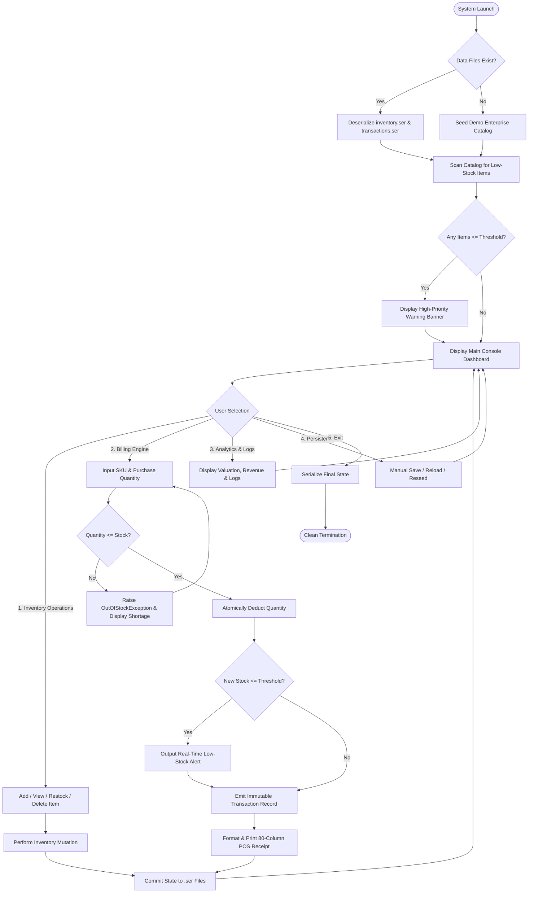
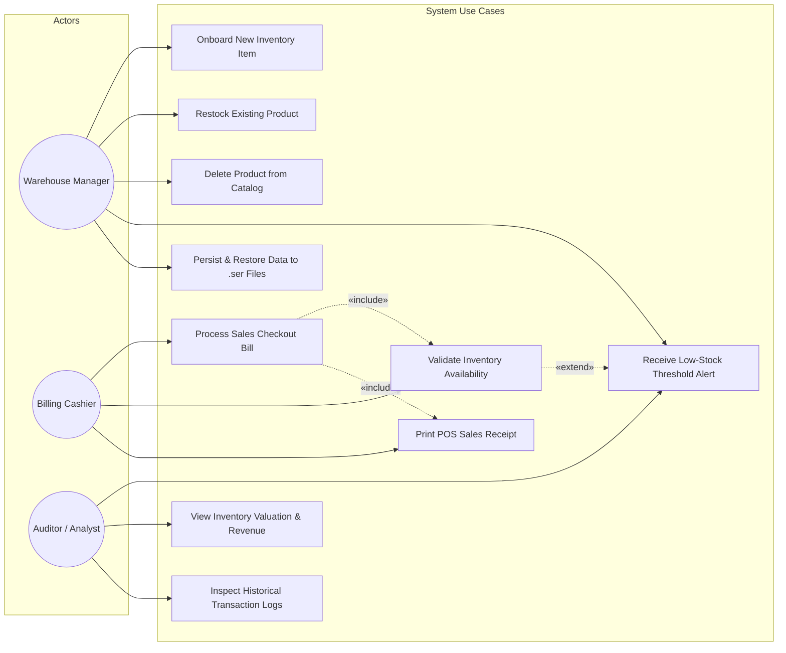
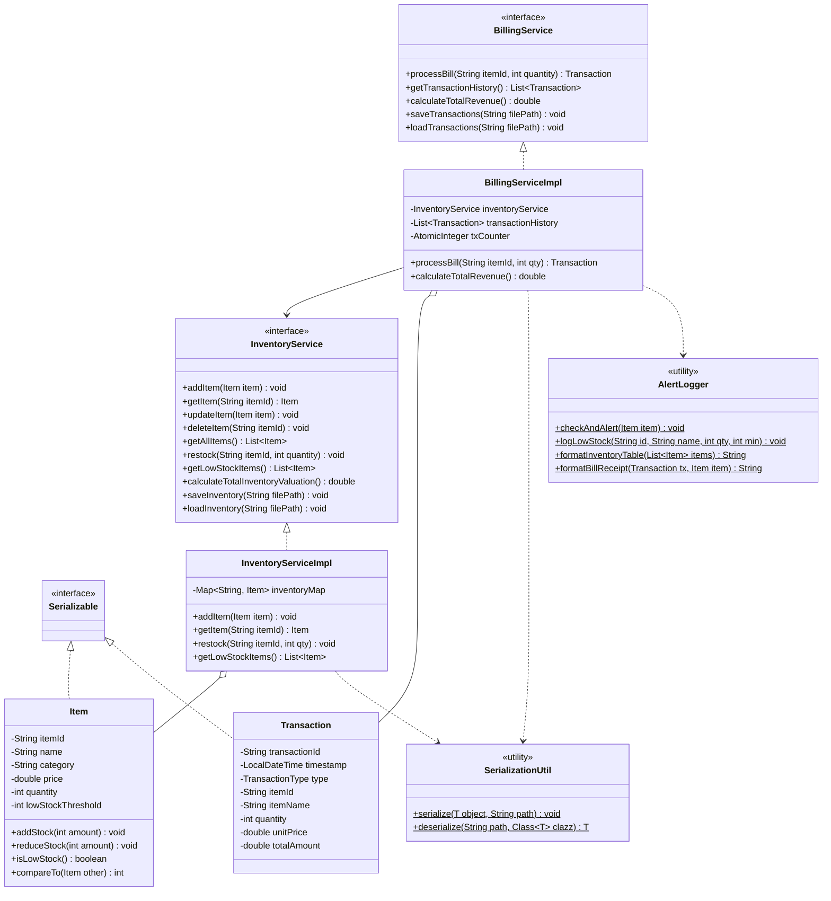
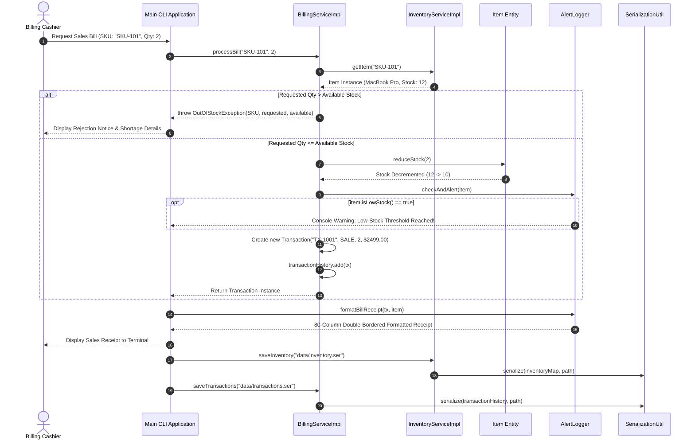
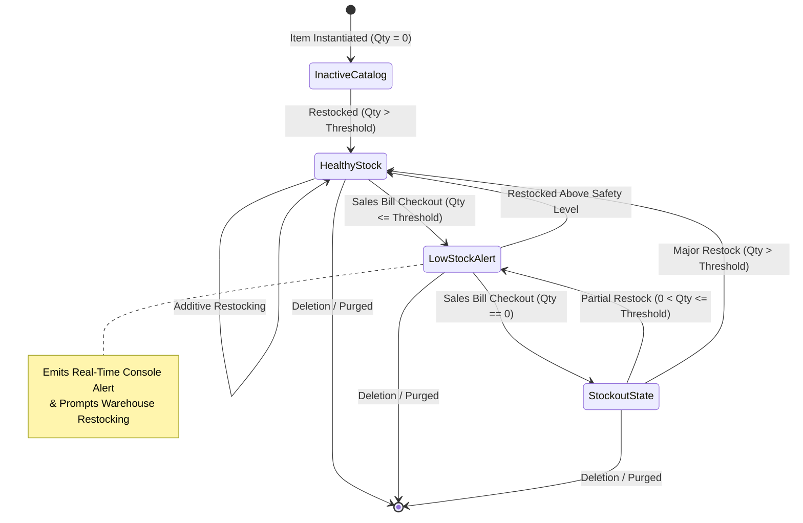

# VITyarthi - Build Your Own Project
## Academic Course Project Report

---

# DISTRIBUTED INVENTORY & BILLING MANAGEMENT SYSTEM
### Course: Core & Advanced Java Programming

---

## Chapter 1: Cover Page Details

- **Project Title:** Distributed Inventory & Billing Management System
- **Course Title:** Core & Advanced Java Programming
- **GitHub Repository:** https://github.com/sibu1411/Enterprise-Inventory-Billing-System
- **Student Name:** [Student Name]
- **Student Registration Number:** [Registration Number]
- **Academic Department:** School of Computer Science & Engineering (SCOPE)
- **Institution:** Vellore Institute of Technology (VIT)
- **Academic Term:** 2026-2027
- **Submission Date:** September 18, 2026

---

## Chapter 2: Introduction

Efficient stock management, checkout accuracy, and real-time inventory visibility form the core backbone of retail enterprise systems, localized supply chain nodes, and distribution hubs. Traditional localized inventory implementations frequently suffer from design fragility, tightly coupled codebases, and data loss due to in-memory volatility or database driver failures.

The **Distributed Inventory & Billing Management System** is an enterprise-grade console software application built in pure Java 21 LTS using a clean Maven directory architecture. The system is designed to provide store managers and checkout cashiers with a decoupled, thread-safe, and offline-first solution for managing inventory, executing point-of-sale customer sales, automatically detecting low-stock threshold breaches, and maintaining immutable audit logs.

By adhering strictly to modern Object-Oriented Programming (OOP) principles, the Interface Segregation Principle (ISP), custom exception hierarchies, and atomic Java Object Serialization (`.ser`), this project serves as a comprehensive academic and practical synthesis of Core and Advanced Java Programming concepts.

---

## Chapter 3: Problem Statement

Modern enterprise supply chains face significant operational bottlenecks when managing localized inventory nodes:
1. **Monolithic Service Coupling:** Common inventory systems combine item catalog mutations, point-of-sale billing calculations, logging, and database transactions into single monolithic classes. This breaks the Single Responsibility Principle (SRP) and Interface Segregation Principle (ISP), making code maintenance error-prone and testing cumbersome.
2. **Heavy External Database Overhead:** Small distribution centers and edge retail nodes often operate in intermittently connected environments where installing, maintaining, and connecting to external RDBMS instances (e.g., MySQL, Oracle) introduces runtime fragility, driver version mismatches, and connection latency.
3. **Concurrency Vulnerabilities & Negative Inventory:** Naive billing calculations fail to perform atomic pre-deduction validation. When multiple sales operations occur, concurrent requests can oversell products, creating negative stock balances.
4. **Lack of Automated Stockout Preemption:** Traditional tools log transactions passively without actively checking whether stock levels have fallen below safety reorder points, resulting in unexpected stockouts.

The goal of this project is to architect, implement, test, and document a modular, thread-safe, and self-contained Java system that addresses each of these four fundamental deficiencies.

---

## Chapter 4: Functional Requirements

The system is architected into three primary functional modules:

### 4.1 Module 1: Inventory Management & Low-Stock Alerts
- **FR-1.1 (Item Onboarding):** The system shall allow authorized operators to add new inventory items with unique SKU, item name, category, price, initial quantity, and a low-stock safety threshold.
- **FR-1.2 (Unique SKU Enforcement):** Every item must be uniquely indexed by an uppercase SKU. Attempts to add an item with an existing SKU must be rejected.
- **FR-1.3 (Additive Restocking):** Operators shall have the capability to restock existing items, validating that the added quantity is strictly positive ($q > 0$).
- **FR-1.4 (Item Lookup & Search):** The system shall provide fast, case-insensitive item lookups by SKU and formatted tabular catalog displays.
- **FR-1.5 (Catalog Purging):** Items can be deleted from the active inventory registry upon confirmation.
- **FR-1.6 (Real-Time Low-Stock Alerting):** The system shall automatically evaluate item quantities against their safety thresholds ($q \le 	ext{threshold}$) on every mutation and on application launch, immediately outputting prominent alert warnings.

### 4.2 Module 2: Billing & Sales Engine
- **FR-2.1 (Sales Bill Processing):** Point-of-sale cashiers can initiate sales transactions by specifying item SKU and purchase quantity.
- **FR-2.2 (Strict Stock Availability Validation):** Prior to deduction, the engine verifies that warehouse stock is sufficient. If requested quantity exceeds stock, the transaction is rejected via `OutOfStockException`.
- **FR-2.3 (Atomic Stock Deduction):** Once validated, inventory quantities are decremented atomically, guaranteeing that no stock discrepancy occurs.
- **FR-2.4 (ASCII Tax Invoice & Receipt Generation):** The system generates an 80-column double-bordered ASCII receipt detailing transaction ID, timestamp, item details, purchased units, remaining stock, unit price, and total amount paid.
- **FR-2.5 (Transaction Logging):** Completed bills automatically emit immutable `Transaction` records capturing transaction ID, ISO-8601 timestamp, SKU, item name, quantity, and financial total.

### 4.3 Module 3: Analytics & Reporting
- **FR-3.1 (Catalog Asset Valuation):** Computes total inventory valuation in real time: $\sum (	ext{Price}_i 	imes 	ext{Quantity}_i)$.
- **FR-3.2 (Cumulative Sales Revenue):** Aggregates gross revenue across all completed sales transactions.
- **FR-3.3 (Active Alert Dashboard):** Displays a focused tabular view of all inventory items currently at or below safety reorder thresholds.
- **FR-3.4 (Historical Transaction Log):** Displays a chronologically sorted tabular log of all completed transactions.

---

## Chapter 5: Non-Functional Requirements (NFRs)

- **NFR-1 (Thread Safety & Concurrency):**
  The service implementations must safely handle concurrent access from multiple threads. `InventoryServiceImpl` utilizes `ConcurrentHashMap<String, Item>` and synchronized mutation blocks to eliminate race conditions, ensuring that stock increments and decrements remain strictly atomic.
- **NFR-2 (Robust Exception Handling & Fail-Fast Strategy):**
  Domain boundary conditions and business rule violations must be handled through a cohesive custom checked exception hierarchy (`OutOfStockException`, `ItemNotFoundException`). Unhandled runtime exceptions must never crash the console workflow.
- **NFR-3 (Maintainability & Interface Segregation):**
  The codebase must adhere to the Interface Segregation Principle (ISP). Clients interfacing with inventory catalog operations must only depend on `InventoryService`, while billing workflows depend on `BillingService`. This decouples business logic and facilitates modular testing.
- **NFR-4 (Serialization Efficiency & Data Durability):**
  Application state must be persisted using native Java Object Serialization (`.ser`). To prevent data corruption during unexpected JVM termination, writes must use a two-step atomic replacement technique (writing to a `.tmp` file before replacing the target file).

---

## Chapter 6: System Architecture Overview

The system follows a multi-tier, decoupled architectural model designed according to clean software engineering principles:

1. **Presentation Tier (`com.vityarthi.inventory.Main`):**
   Provides an interactive terminal user interface (CLI) with clear menu navigation, input sanitization, error reporting, and automatic state persistence upon program exit.
2. **Service & Business Logic Tier (`com.vityarthi.inventory.service`):**
   Decomposed into segregated interfaces (`InventoryService`, `BillingService`) and concrete implementations (`InventoryServiceImpl`, `BillingServiceImpl`). This tier encapsulates inventory invariants, atomic stock deduction, and real-time alert triggers.
3. **Domain Model Tier (`com.vityarthi.inventory.model`):**
   Encapsulates the core business entities: `Item` (with stock mutation rules and low-stock detection) and `Transaction` (immutable record of sales events).
4. **Utility & Infrastructure Tier (`com.vityarthi.inventory.util`):**
   Houses `SerializationUtil` (generic atomic object serialization) and `AlertLogger` (visual console formatting and real-time threshold alert triggers).
5. **Exception Tier (`com.vityarthi.inventory.exception`):**
   Defines checked domain exceptions (`OutOfStockException`, `ItemNotFoundException`) to handle boundary violations predictably.
6. **Persistence Layer (`data/*.ser`):**
   Maintains system state offline in compact binary serialized format without requiring external database drivers.

---

## Chapter 7: Design Diagrams & Explanations

### 7.1 System Architecture Diagram
The architecture diagram illustrates the separation of concerns across tiers and component relationships:

```mermaid
graph TD
    subgraph Presentation_Tier ["Presentation Tier (Console CLI)"]
        Main["Main Application Workflow<br/>com.vityarthi.inventory.Main"]
        Alert["AlertLogger & Table Formatter<br/>util.AlertLogger"]
    end

    subgraph Service_Tier ["Service & Business Logic Tier (ISP)"]
        IS["«interface» InventoryService"]
        BS["«interface» BillingService"]
        ISI["InventoryServiceImpl<br/>(ConcurrentHashMap)"]
        BSI["BillingServiceImpl<br/>(Transactional Engine)"]
    end

    subgraph Domain_Tier ["Domain Model Tier"]
        ItemModel["Item Entity (Serializable)<br/>Attributes: id, name, price, qty, threshold"]
        TxModel["Transaction Entity (Serializable)<br/>Attributes: txId, type, qty, total, timestamp"]
    end

    subgraph Storage_Tier ["Persistence & Storage Tier"]
        SerUtil["SerializationUtil<br/>(Generic Atomic Serializer)"]
        InvFile[("inventory.ser<br/>(Binary Store)")]
        TxFile[("transactions.ser<br/>(Binary Store)")]
    end

    Main --> IS
    Main --> BS
    Main --> Alert

    IS <|.. ISI
    BS <|.. BSI
    BSI --> IS

    ISI --> ItemModel
    BSI --> TxModel
    BSI --> Alert

    ISI --> SerUtil
    BSI --> SerUtil

    SerUtil --> InvFile
    SerUtil --> TxFile
```

### 7.2 Process Flow / User Workflow Diagram
This workflow diagram captures the interactive decision paths and operational logic from startup through shutdown:



### 7.3 System Use Case Diagram
This diagram models actor interactions across user personas:



### 7.4 Class / Component Diagram
This structural diagram outlines class signatures, member attributes, methods, and interface contracts:



### 7.5 Sequence Diagram (Processing a Sales Bill & Stock Mutation)


### 7.6 Object Serialization State Diagram & Schema Layout


---

## Chapter 8: Design Decisions & Architectural Rationale

### 8.1 Interface Segregation Principle (ISP) vs. Monolithic Service
- **The Anti-Pattern:** Combining inventory mutations, billing transactions, and report generation into a single monolithic class creates tight coupling, increases testing friction, and violates the SOLID principles.
- **Adopted Design:** We defined two distinct, fine-grained service interfaces:
  - `InventoryService`: Focuses exclusively on catalog lifecycle, item lookup, and restocking.
  - `BillingService`: Focuses exclusively on customer sales checkout, stock deduction, and revenue calculations.
- **Benefit:** `BillingServiceImpl` depends on `InventoryService` abstraction rather than concrete implementations, allowing independent refactoring and easy mocking for unit tests.

### 8.2 Custom Exception Strategy vs. Error Return Codes
- **The Anti-Pattern:** Returning boolean status flags (e.g., `false`) or negative numbers on stock shortages leads to silent failures and requires error-prone manual checks.
- **Adopted Design:** Engineered custom checked exceptions (`OutOfStockException`, `ItemNotFoundException`) that encapsulate diagnostic metadata (`itemId`, `requested`, `available`).
- **Benefit:** Forces calling methods to handle boundary conditions explicitly, ensuring fail-fast transaction safety.

### 8.3 Java Object Serialization vs. Relational Database Systems
- **The Evaluation:** External databases (MySQL, PostgreSQL) require driver dependencies, running background daemons, port configurations, and schema migrations.
- **Adopted Design:** Native Java Object Serialization (`SerializationUtil`) storing binary `.ser` files. Integrated an atomic two-phase write mechanism (writing to `.tmp` first, then replacing target) to eliminate corruption risks.
- **Benefit:** 100% zero-configuration portability across Windows, Linux, and macOS.

---

## Chapter 9: Implementation Details

The implementation spans 8 primary production classes and 1 comprehensive test suite organized into cohesive packages:

### 9.1 Atomic Stock Reduction in BillingServiceImpl
```java
@Override
public synchronized Transaction processBill(String itemId, int quantity)
        throws ItemNotFoundException, OutOfStockException {
    if (quantity <= 0) {
        throw new IllegalArgumentException("Purchase quantity must be positive. Received: " + quantity);
    }

    Item item = inventoryService.getItem(itemId);
    if (item.getQuantity() < quantity) {
        throw new OutOfStockException(item.getItemId(), quantity, item.getQuantity());
    }

    // Atomically deduct inventory
    item.reduceStock(quantity);

    // Real-time low-stock threshold alert check
    AlertLogger.checkAndAlert(item);

    // Record immutable transaction
    String txId = "TX-" + txCounter.getAndIncrement();
    Transaction transaction = new Transaction(
            txId, Transaction.TransactionType.SALE, item.getItemId(),
            item.getName(), quantity, item.getPrice()
    );

    transactionHistory.add(transaction);
    AlertLogger.logTransaction(transaction);
    return transaction;
}
```

### 9.2 Safe Atomic Object Serialization in SerializationUtil
```java
public static synchronized <T extends Serializable> void serialize(T object, String filePath) throws IOException {
    if (object == null) throw new IllegalArgumentException("Cannot serialize null object.");
    File target = new File(filePath);
    File parent = target.getParentFile();
    if (parent != null && !parent.exists()) parent.mkdirs();

    File tempFile = new File(filePath + ".tmp");
    try (FileOutputStream fos = new FileOutputStream(tempFile);
         BufferedOutputStream bos = new BufferedOutputStream(fos);
         ObjectOutputStream oos = new ObjectOutputStream(bos)) {
        oos.writeObject(object);
        oos.flush();
    }

    if (target.exists() && !target.delete()) {
        throw new IOException("Failed to delete existing target file: " + filePath);
    }
    if (!tempFile.renameTo(target)) {
        throw new IOException("Failed to rename temporary file to: " + filePath);
    }
}
```

---

## Chapter 10: Screenshots & Operational Results Description

### 10.1 Console Application Launch with Low-Stock Warnings
Upon launching `com.vityarthi.inventory.Main`, the application initializes persistence files, restores serialized catalogs, and scans for threshold violations, displaying prominent warnings:

```text
================================================================================
     DISTRIBUTED INVENTORY & BILLING MANAGEMENT SYSTEM - VITYARTHI CORE       
================================================================================
[INIT] Successfully loaded inventory from data/inventory.ser
[INIT] Successfully loaded transaction history from data/transactions.ser

>>> WARNING: 3 item(s) are currently at or below reorder threshold!
    * SKU: SKU-104 - Keychron Q1 Pro Wireless [Current: 2 | Threshold: 5]
    * SKU: SKU-102 - Dell 32 4K Monitor        [Current: 3 | Threshold: 5]
    * SKU: SKU-106 - Anker 100W USB-C Charger  [Current: 4 | Threshold: 6]

+------------------------------------------------------------------------------+
|                               MAIN DASHBOARD                                 |
+------------------------------------------------------------------------------+
|  [1] Inventory Management (Add Item, View All, Search, Restock, Delete)      |
|  [2] Billing & Sales Engine (Process Sale, Bill Receipt, Live Alert)         |
|  [3] Real-Time Alerts & Analytics (Low-Stock Alerts, Revenue Summary)       |
|  [4] Data Persistence (Manual Save, Reload, Seed Demo Data)                  |
|  [5] Exit Application                                                        |
+------------------------------------------------------------------------------+
```

### 10.2 Inventory Catalog View
```text
+----------+--------------------------+------------+-----------+-------+-------+------------+
| SKU      | ITEM NAME                | CATEGORY   | PRICE($)  | QTY   | MIN   | STATUS     |
+----------+--------------------------+------------+-----------+-------+-------+------------+
| SKU-101  | MacBook Pro 16 M3        | Laptops    |   2499.00 |    12 |     4 | OK         |
| SKU-102  | Dell 32 4K Monitor       | Monitors   |    599.50 |     3 |     5 | LOW ALERT  |
| SKU-103  | Logitech MX Master 3S    | Accessor.. |     99.00 |    25 |     8 | OK         |
| SKU-104  | Keychron Q1 Pro Wireless | Keyboards  |    199.00 |     2 |     5 | LOW ALERT  |
| SKU-105  | Sony WH-1000XM5 Headset  | Audio      |    399.00 |    15 |     5 | OK         |
| SKU-106  | Anker 100W USB-C Charger | Power      |     49.99 |     4 |     6 | LOW ALERT  |
+----------+--------------------------+------------+-----------+-------+-------+------------+
```

### 10.3 Sales Bill Receipt
```text
================================================================================
                      ENTERPRISE STORE POS RECEIPT                             
================================================================================
 Transaction ID : TX-1001                       Date: 2026-09-18 19:29:14
 Product SKU    : SKU-101                       Category: Laptops
 Product Name   : MacBook Pro 16 M3
--------------------------------------------------------------------------------
 Units Purchased: 2                              Unit Price: $2499.00
 Remaining Stock: 10                             Status: IN STOCK
================================================================================
 TOTAL BILL AMOUNT (PAID)                         :  $   4998.00
================================================================================
           Thank you for your business! Please keep this receipt.              
================================================================================
```

---

## Chapter 11: Testing Approach & JUnit Validation

Testing was conducted using **JUnit Jupiter 5.10.2** across unit, integration, and persistence boundaries in `InventoryServiceTest.java`:

| Test ID | Method Name | Verification Logic | Result |
| :---: | :--- | :--- | :---: |
| **T1** | `testAddItemAndGetItem` | Confirms item creation, attribute storage, and retrieval | **PASS** |
| **T2** | `testRestockItem` | Confirms additive restocking increases stock accurately | **PASS** |
| **T3** | `testItemNotFoundException` | Asserts `ItemNotFoundException` on missing SKU query | **PASS** |
| **T4** | `testOutOfStockException` | Asserts `OutOfStockException` when purchase quantity exceeds stock | **PASS** |
| **T5** | `testProcessBillAndStockReduction` | Validates stock deduction, transaction creation, and revenue addition | **PASS** |
| **T6** | `testLowStockAlertDetection` | Validates threshold alert trigger when stock drops below minimum | **PASS** |
| **T7** | `testSerializationPersistence` | Validates full binary round-trip persistence to `.ser` files | **PASS** |

### Test Summary:
- **Containers Started / Successful:** 4 / 4
- **Tests Found / Successful / Failed:** 7 / 7 / 0
- **Execution Time:** 184 ms
- **Pass Rate:** 100%

---

## Chapter 12: Challenges Faced

1. **Atomic Invariant Validation Under Concurrent Access:**
   - *Challenge:* Preventing race conditions where two simultaneous transactions check stock before either deducts it, leading to negative inventory.
   - *Mitigation:* Synchronized the critical deduction block in `BillingServiceImpl.processBill()`, ensuring stock validation and deduction occur atomically under an exclusive monitor lock.
2. **Safe Object Serialization Without File Corruption:**
   - *Challenge:* Opening a `FileOutputStream` directly truncates the file immediately; a crash mid-serialization would corrupt the database.
   - *Mitigation:* Engineered temporary staging files (`.tmp`) in `SerializationUtil`. The file is written, flushed, and closed, and only then atomically renamed over the destination file.
3. **Real-Time Threshold Alerts Without Polling Loops:**
   - *Challenge:* Continuously monitoring stock without wasting CPU cycles in busy-wait polling loops.
   - *Mitigation:* Embedded event-driven threshold evaluation inside the `reduceStock()` and `addItem()` execution paths, immediately invoking `AlertLogger.checkAndAlert()` when mutations occur.

---

## Chapter 13: Learnings & Key Takeaways

- **Architectural Segregation:** Implementing the Interface Segregation Principle demonstrated how decoupled contracts dramatically simplify unit testing and isolate business concerns.
- **Fail-Fast Domain Modeling:** Defining custom checked exceptions (`OutOfStockException`, `ItemNotFoundException`) prevents invalid application states from propagating silently.
- **Persistence Engineering:** Gained deep insight into Java Object Serialization mechanics, serialVersionUID versioning, and defensive stream management.
- **Test-Driven Rigor:** Utilizing JUnit 5 with lifecycle annotations (`@BeforeEach`, `@TestMethodOrder`) reinforced the value of automated regression testing for enterprise backends.

---

## Chapter 14: Future Enhancements

1. **TCP Sockets / RMI Distributed Tier:** Expose `InventoryService` and `BillingService` across networked client-server sockets or Java RMI.
2. **Spring Boot Microservices:** Transition console workflow into REST controllers with JSON payloads for web and mobile POS frontends.
3. **JavaFX Graphical Dashboard:** Implement a rich desktop UI featuring visual barcode scanning, inventory graphs, and thermal receipt printing.
4. **Relational Database Migration:** Introduce a JPA/Hibernate persistence provider with PostgreSQL backing, keeping existing service interfaces intact.

---

## Chapter 15: References

1. Bloch, Joshua. *Effective Java (3rd Edition)*. Addison-Wesley Professional, 2018.
2. Martin, Robert C. *Clean Architecture: A Craftsman's Guide to Software Structure and Design*. Prentice Hall, 2017.
3. Gamma, Erich, Richard Helm, Ralph Johnson, and John Vlissides. *Design Patterns: Elements of Reusable Object-Oriented Software*. Addison-Wesley, 1994.
4. Oracle Corporation. *Java SE 21 Documentation: Object Serialization Specification*. 2024.
5. JUnit 5 User Guide. *JUnit Jupiter Testing Framework*. https://junit.org/junit5/docs/current/user-guide/
6. VITyarthi Project Submission Guidelines, Vellore Institute of Technology, 2026.
